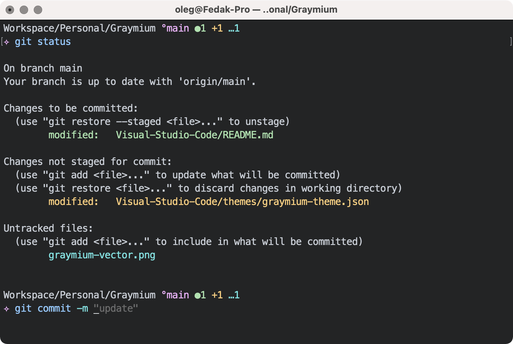

 

# Graymium for Terminal.app

The [Graymium](https://github.com/olegfedak/graymium) color scheme for MacOS Terminal.

    
   
    
   
<i>Shell Prompt for Zsh from <a href="https://github.com/olegfedak/ash">Ash Theme</a></i>

    

## Setup

1. Run `curl -O https://raw.githubusercontent.com/olegfedak/graymium/main/MacOS-Terminal/Graymium.terminal`
   or [save the file manually](https://raw.githubusercontent.com/olegfedak/graymium/main/MacOS-Terminal/Graymium.terminal) as "Graymium.terminal"

2. Open `Graymium.terminal`

3. Open Terminal preferences (<kbd>cmd</kbd> + <kbd>,</kbd>)

4. Go to Profiles and select `Graymium`

## License

This project is open source and available under the [MIT License](../LICENSE).
