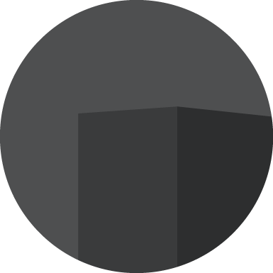
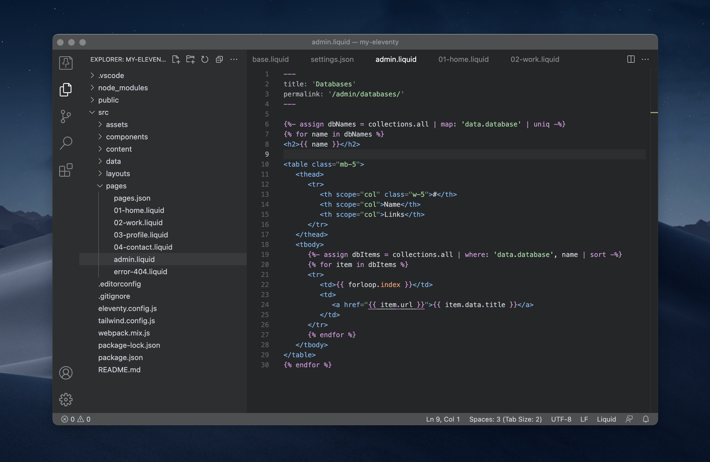

 

# Graymium Theme

Dark gray theme for web development and designing by code. Syntax highlighting is provided for markup, styling and scripting. Sometimes, something new is adding.

## Platforms
-  [Visual Studio Code](./Visual-Studio-Code/)
-  [MacOS Terminal](./MacOS-Terminal/)

## Syntax highlighting in Editor

-  JSON, YAML
-  Markdown
-  HTML
-  CSS, SCSS
-  JavaScript, TypeScript
-  Liquid, Nunjucks

## License

This project is open source and available under the [MIT License](./LICENSE), created by [Oleg Fedak](https://github.com/olegfedak)
