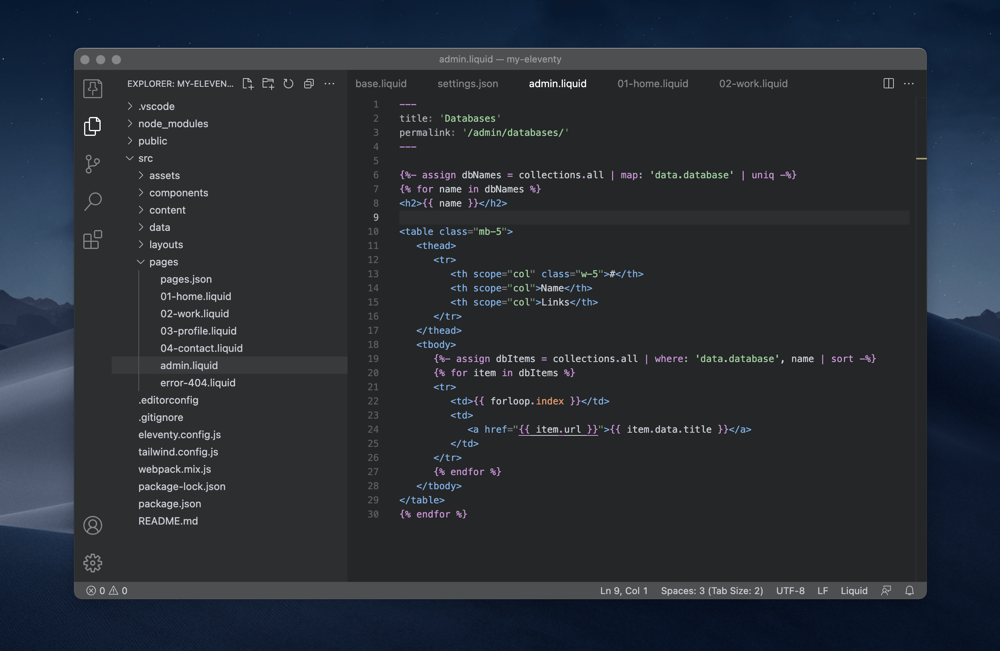

<!-- <p align="center">
 
</p> -->

# Graymium Theme for VSCode

The dark gray theme for web development and designing by code. Syntax highlighting is provided for markup, styling and scripting. This theme is optimised to be minimalistic and easy on the eyes for long coding hours.

> ☝ In addition to colors, certain interface settings will be also changed. See "configuration defaults" below.

## Syntax highlighting

- JSON, YAML
- Markdown
- HTML
- CSS, SCSS
- JavaScript, TypeScript
- Liquid, Nunjucks

## Install

Go to [Marketplace](https://marketplace.visualstudio.com/items?itemName=olegfedak.graymium-vscode) and click on the "install" button or do it in VSCode:
1. Go to `View -> Extensions`
2. Search for `Graymium Theme`
3. Click on Install

## Configuration defaults

<details>
  <summary>All Settings</summary>

```json
{
   "workbench.colorTheme": "Graymium Theme",
   "workbench.editor.tabSizing": "fit",
   "workbench.iconTheme": null,
   "workbench.tree.indent": 14,
   "workbench.tree.renderIndentGuides": "none",
   "workbench.editor.decorations.colors": false,
   "explorer.compactFolders": false,
   "explorer.decorations.colors": false,
   "editor.autoIndent": "brackets",
   "editor.bracketPairColorization.enabled": false,
   "editor.linkedEditing": true,
   "editor.formatOnPaste": true,
   "editor.formatOnSave": true,
   "editor.formatOnType": false,
   "editor.fontFamily": "Menlo, SF Mono",
   "editor.fontSize": 12,
   "editor.lineHeight": 1.5,
   "editor.fontWeight": "500",
   "editor.cursorBlinking": "phase",
   "editor.cursorStyle": "line",
   "editor.guides.indentation": false,
   "editor.minimap.size": "fit",
   "editor.minimap.enabled": false,
   "terminal.integrated.lineHeight": 1.2,
   "terminal.integrated.shellIntegration.decorationsEnabled": "never",
   "files.trimTrailingWhitespace": true,
   "files.trimFinalNewlines": true,
   "files.associations": {
      "*.njk": "nunjucks",
      "*.liquid": "liquid"
   },
   "html.format.enable": true,
   "html.format.extraLiners": "body",
   "html.format.maxPreserveNewLines": 1,
   "[liquid]": {
      "editor.defaultFormatter": "vscode.html-language-features"
   }
   "window.commandCenter": false,
   "workbench.layoutControl.enabled": false,
   "breadcrumbs.enabled": false,
   "scm.repositories.visible": 0,
   "scm.showActionButton": false,
   "scm.alwaysShowActions": false,
   "scm.diffDecorationsGutterVisibility": "hover",
   "explorer.confirmDragAndDrop": false,
   "explorer.incrementalNaming": "smart",
   "explorer.confirmDelete": false
}
```
</details>
<br>

## Recommendations

* Code fonts: Menlo (by default on MacOS), or [SF Mono](https://github.com/supercomputra/SF-Mono-Font).

* To make better use of [Nunjucks](https://mozilla.github.io/nunjucks/) syntax highlighting inside of Markdown, HTML etc. — try [Better Nunjucks](https://marketplace.visualstudio.com/items?itemName=ginfuru.better-nunjucks) extension. But it's not necessary.

* Working with Liquid try [this Liquid VSCode extension](https://marketplace.visualstudio.com/items?itemName=sissel.shopify-liquid). (Supports Formatting, Syntax Highlighting, Snippets, HTML IntelliSense and other essential features).

## Feedback

If you have suggestions, please [open an issue](https://github.com/olegfedak/graymium/issues) or better yet, a [pull request](https://github.com/olegfedak/graymium/pulls).

## Author

[Oleg Fedak](https://github.com/olegfedak)

## License

This project is open source and available under the [MIT License](../LICENSE)
